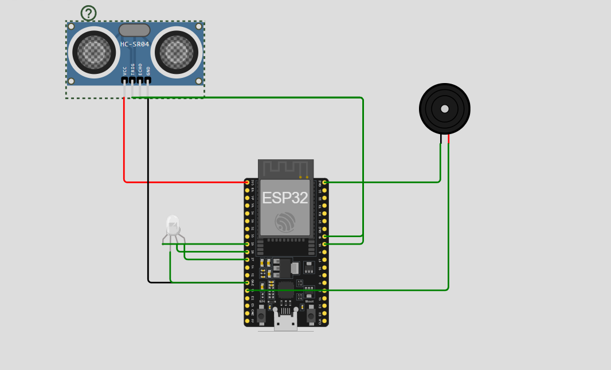

# 🩺 Smart Ergonomics & Fatigue Monitor (IoT)


  

## 👥 Integrantes do Grupo
* **Bryan Willian** (RM551305)
* **Gabriel Freitas** (RM550187)
* **Felipe Terra** (RM99405)

---

## 🌍 Contexto: O Futuro do Trabalho e a Saúde
Com a consolidação do *Home Office* e dos modelos híbridos, surgiram novos desafios para a saúde do trabalhador. A ausência de ergonomia supervisionada e o excesso de horas ininterruptas geram **má postura**, **fadiga crônica** e **Burnout**.

Este projeto propõe uma **Estação de Trabalho Inteligente** que utiliza IoT para monitorar ativamente o bem-estar do colaborador, alinhando produtividade com saúde ocupacional.

---

## 💡 A Solução
O dispositivo atua como um assistente pessoal de ergonomia. Diferente de soluções passivas, ele intervém em tempo real:

1.  **Monitoramento de Postura:** Alerta instantâneo (Visual e Sonoro) se o utilizador se aproximar demasiado da tela (postura curvada).
2.  **Gestão de Pausas (Anti-Burnout):** Um temporizador inteligente bloqueia a estação após um período contínuo, exigindo uma pausa obrigatória.
3.  **Conectividade MQTT:** Envia dados para a nuvem, permitindo que gestores acompanhem métricas de saúde da equipa remotamente.

---

## 🛠️ Hardware e Montagem

O projeto foi desenvolvido e simulado na plataforma **Wokwi**.

### Componentes Utilizados:
* **ESP32 DevKit V1:** Microcontrolador com Wi-Fi integrado.
* **HC-SR04:** Sensor de Ultrassom (mede a distância do utilizador).
* **LED RGB:** Feedback visual de status (Verde = OK, Amarelo = Alerta, Vermelho = Pausa).
* **Buzzer:** Feedback sonoro para alertas e bloqueio.

### 📸 Diagrama do Circuito


---

## 📡 Arquitetura IoT (MQTT)

O sistema utiliza o protocolo MQTT para comunicação bidirecional com a nuvem.

* **Broker:** `broker.hivemq.com`
* **Porta:** `1883`

| Tópico | Tipo | Descrição |
| :--- | :--- | :--- |
| `futuro_trabalho/ergonomia/status` | **Publish** | Envia o estado atual (`OK`, `ALERTA`, `PAUSA`). |
| `futuro_trabalho/ergonomia/distancia` | **Publish** | Envia a distância medida em cm. |
| `futuro_trabalho/ergonomia/pausa_cmd` | **Subscribe** | Recebe comando remoto para destravar o sistema (`REINICIAR_TIMER`). |

---

## 🚀 Como Executar o Projeto

### 1. Acesso à Simulação
O projeto está totalmente funcional no Wokwi. Acesse através do link abaixo:

🔗 **[https://wokwi.com/projects/448171544208091137](https://wokwi.com/projects/448171544208091137)**

### 2. Dependências
Certifique-se de instalar a seguinte biblioteca na IDE do Arduino ou no `libraries.txt` do Wokwi:
* `PubSubClient` 

### 3. Código Fonte (`sketch.ino`)

```cpp
#include <WiFi.h>
#include <PubSubClient.h>

// --- CONFIGURAÇÕES ---
const char* ssid = "Wokwi-GUEST";
const char* password = "";
const char* mqtt_server = "broker.hivemq.com";
const char* mqtt_client_id = "esp32-gs-students-v1";

const int trigPin = 18;
const int echoPin = 19;
const int ledR = 25;
const int ledG = 26;
const int ledB = 27;
const int buzzerPin = 13;

#define DISTANCIA_MIN 35 
#define DISTANCIA_MAX 55 
const unsigned long LIMITE_TRABALHO = 15000; // 15s para demonstração (vídeo)

unsigned long tempoInicioTrabalho = 0;
long distanciaAtual = 0;

// TÓPICOS MQTT
const char* TOPICO_STATUS = "futuro_trabalho/ergonomia/status";
const char* TOPICO_DISTANCIA = "futuro_trabalho/ergonomia/distancia";
const char* TOPICO_COMANDO = "futuro_trabalho/ergonomia/pausa_cmd";

WiFiClient espClient;
PubSubClient client(espClient);

// --- FUNÇÕES ---

void setCor(bool r, bool g, bool b) {
  // Configuração Cátodo Comum (HIGH = Liga)
  digitalWrite(ledR, r ? HIGH : LOW);
  digitalWrite(ledG, g ? HIGH : LOW);
  digitalWrite(ledB, b ? HIGH : LOW);
}

long lerDistancia() {
  digitalWrite(trigPin, LOW);
  delayMicroseconds(2);
  digitalWrite(trigPin, HIGH);
  delayMicroseconds(10);
  digitalWrite(trigPin, LOW);
  long duration = pulseIn(echoPin, HIGH);
  return duration * 0.034 / 2;
}

void setup_wifi() {
  Serial.print("Conectando Wifi...");
  WiFi.begin(ssid, password);
  int tentativas = 0;
  while (WiFi.status() != WL_CONNECTED && tentativas < 20) {
    delay(500);
    Serial.print(".");
    tentativas++;
  }
  Serial.println(WiFi.status() == WL_CONNECTED ? " OK!" : " Offline");
}

void callback(char* topic, byte* payload, unsigned int length) {
  String msg = "";
  for (int i = 0; i < length; i++) { msg += (char)payload[i]; }
  Serial.print("Mensagem Recebida: "); Serial.println(msg);

  if (String(topic) == TOPICO_COMANDO && msg == "REINICIAR_TIMER") {
    tempoInicioTrabalho = millis();
    noTone(buzzerPin);
    setCor(0,1,0); // Verde
    client.publish(TOPICO_STATUS, "TRABALHO_RETOMADO");
    Serial.println(">>> SISTEMA DESTRAVADO <<<");
  }
}

void reconnect() {
  if (WiFi.status() != WL_CONNECTED) return;
  if (!client.connected()) {
    if (client.connect(mqtt_client_id)) {
      client.subscribe(TOPICO_COMANDO);
    }
  }
}

// --- SETUP E LOOP ---

void setup() {
  Serial.begin(115200);
  pinMode(trigPin, OUTPUT); pinMode(echoPin, INPUT);
  pinMode(ledR, OUTPUT); pinMode(ledG, OUTPUT); pinMode(ledB, OUTPUT);
  pinMode(buzzerPin, OUTPUT);

  setup_wifi();
  client.setServer(mqtt_server, 1883);
  client.setCallback(callback);
  tempoInicioTrabalho = millis();
}

void loop() {
  if (WiFi.status() == WL_CONNECTED) {
     if (!client.connected()) reconnect();
     client.loop();
  }

  // Verifica Pausa Obrigatória
  if (millis() - tempoInicioTrabalho >= LIMITE_TRABALHO) {
    if ((millis() / 500) % 2 == 0) { 
      setCor(1, 0, 0); // Vermelho piscando
      tone(buzzerPin, 1000); 
    } else {
      setCor(0, 0, 0);
      noTone(buzzerPin);
    }
    
    static unsigned long timerMsg = 0;
    if (millis() - timerMsg > 1000) {
      client.publish(TOPICO_STATUS, "PAUSA_NECESSARIA");
      timerMsg = millis();
    }
    return;
  }

  // Monitoramento Normal
  static unsigned long delaySensor = 0;
  if (millis() - delaySensor < 500) return; 
  delaySensor = millis();

  distanciaAtual = lerDistancia();
  
  if (distanciaAtual < DISTANCIA_MIN || distanciaAtual > DISTANCIA_MAX) {
    setCor(1, 1, 0); // Amarelo
    client.publish(TOPICO_STATUS, "ALERTA_POSTURA");
    tone(buzzerPin, 500, 100); 
  } else {
    setCor(0, 1, 0); // Verde
    client.publish(TOPICO_STATUS, "OK");
    noTone(buzzerPin);
  }
}
